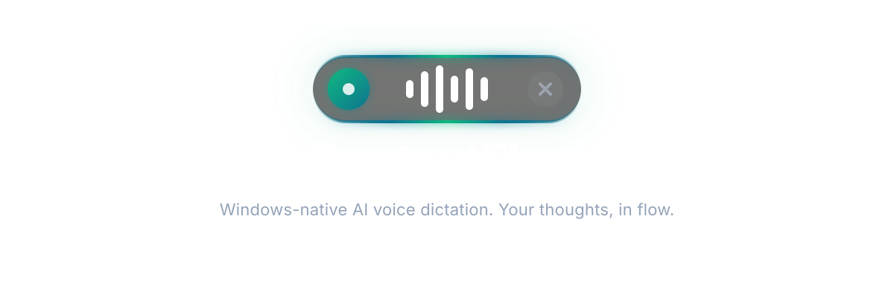

<p align="center">
  
</p>

<p align="center">
  <a href="https://github.com/your-org/contextflow/releases"></a>
  <a href="./LICENSE"></a>
  <a href="https://github.com/your-org/contextflow/actions"></a>
  <a href="https://www.rust-lang.org"></a>
</p>

<p align="center">
  <b>Windows-native AI voice dictation</b> — press a hotkey, speak naturally, and have polished text appear in any application. Fully offline by default, sub-300ms latency, everywhere on Windows.
</p>

---

## Why ContextFlow?

Typing is a bottleneck. Voice is faster, but existing solutions fall short:

**Windows built-in dictation** is slow, only works in select text fields, can't clean filler words, and doesn't understand natural corrections. **Cloud dictation services** send your audio to remote servers, add network latency, and stop working offline.

ContextFlow is built differently:

- **Universal injection** — types into every Windows text field: browsers, VS Code, Slack, terminals, Win32 dialogs, Office. If a caret blinks, ContextFlow can fill it.
- **Offline-first** — the default pipeline (whisper.cpp) runs entirely on your machine. No audio ever leaves your computer unless you explicitly opt into a cloud provider.
- **Low latency** — speech recognition is streamed with <300ms visible lag. The pipeline is tuned for speed from capture to text.
- **AI-native** — the AI cleanup layer understands spoken edits ("meet at 2, actually 3" → "meet at 3"), removes filler words, and adds punctuation automatically.

---

## Features

| Area | Capability |
|------|-----------|
| **Capture** | WASAPI loopback via cpal, 16 kHz resampling via rubato, voice activity detection via webrtc-vad, lock-free ring buffer |
| **Speech** | Pluggable providers via `SpeechProvider` trait — whisper.cpp (CUDA-accelerated), Windows SR, faster-whisper, Deepgram, OpenAI Realtime |
| **Injection** | Layered strategy: UI Automation → SendInput → clipboard. Falls through automatically. Per-app routing planned. |
| **AI** | Cleanup pipeline for punctuation, filler-word removal, spoken-correction resolution |
| **Hotkey** | Global hotkey (Ctrl+Space) with cross-app lifecycle, keyboard hook for reliable release detection |
| **UI** | Floating bubble with audio-reactive visualizer, state-driven animations, transparent always-on-top overlay |
| **Privacy** | All processing on-device by default. No telemetry without explicit opt-in. API keys in Windows Credential Manager. |

---

## Architecture

ContextFlow is a Rust workspace inside a Tauri 2 desktop shell. The frontend is a minimal React overlay that shows dictation state; the entire speech pipeline runs in Rust.

```text
apps/
  desktop/                Tauri 2 shell + React UI (bubble, settings)
core/
  audio-engine/           cpal capture, rubato resampling, VAD, rtrb ring buffer
  speech-engine/          SpeechProvider trait + provider implementations
  text-injection/         UIA / SendInput / clipboard strategies
  dictation-engine/       Session orchestrator: hotkey → capture → speech → inject
  context-engine/         Focused-window detection, per-app routing profiles
  ai-engine/              AI cleanup + voice-command abstraction
  hotkey/                 Global hotkey registration + low-level keyboard hook
  settings/               Persisted config (SQLite + serde)
  telemetry/              Opt-in metrics, structured logging, crash reporting
crates/
  ipc-contracts/          Typed Tauri command/event contracts (Rust ↔ TypeScript)
```

The central design decision is the **`SpeechProvider` trait** in `core/speech-engine`. Every speech engine implements the same interface — the dictation orchestrator never touches a concrete provider. Swapping from local whisper.cpp to cloud Deepgram requires zero changes in the capture, VAD, or injection layers.

See [ARCHITECTURE.md](./ARCHITECTURE.md) for the full technical design.

---

## Quickstart

### Prerequisites

| Tool | Version | Notes |
|------|---------|-------|
| Windows 10/11 | 22H2+ | Required for WinRT speech APIs |
| Rust | stable | `rustup toolchain install stable` |
| Node.js | 20+ | LTS recommended |
| pnpm | 9+ | `npm install -g pnpm` |
| VS Build Tools | 2022+ | C++ workload + Windows 11 SDK |
| CMake | 3.x | For whisper.cpp (`winget install cmake`) |

### Setup

```powershell
# Clone
git clone https://github.com/your-org/contextflow.git
cd contextflow

# Install JavaScript dependencies
pnpm install

# Verify the workspace compiles
cargo check --workspace

# Run in dev mode (hot-reload UI + Rust backend)
pnpm tauri dev
```

The first launch downloads the speech model (~142 MB) from HuggingFace automatically.

### Dev Workflow

Our scripts set up all required environment variables automatically:

```powershell
# Development (with CUDA GPU acceleration)
.\run-dev.ps1

# Release build
.\build.ps1
```

See [docs/acceptance/slice-1.md](./docs/acceptance/slice-1.md) for the acceptance test procedure.

---

## Roadmap

We ship in vertical slices — each is independently runnable and acceptance-tested on Windows.

| Slice | Goal | Status |
|------:|------|--------|
| 1 | End-to-end thin vertical: hotkey → Notepad | Done |
| 2 | Local speech pipeline (whisper.cpp, auto-download, streaming) | Done |
| 3 | Robust text injection (UIA, per-app strategies) | In progress |
| 4 | AI cleanup + voice commands | Planned |
| 5 | Context engine, snippets, personal dictionary, settings UI | Planned |
| 6 | Reliability, watchdog, installer, auto-update, telemetry | Planned |

Detailed plans in [ROADMAP.md](./ROADMAP.md).

---

## Contributing

We follow [Conventional Commits](https://www.conventionalcommits.org/) and enforce code quality with Lefthook pre-commit hooks. Every PR runs the full CI suite — `cargo clippy -D warnings`, `cargo fmt`, `cargo check`, `pnpm lint`, and `pnpm typecheck`.

Start with [CONTRIBUTING.md](./CONTRIBUTING.md) for branch conventions, PR workflow, and coding standards.

---

## Security & Privacy

- All speech audio stays **on-device** by default. No data leaves your machine unless you explicitly enable a cloud provider.
- API keys are stored in the **Windows Credential Manager**, never in plain text.
- Telemetry is **opt-in**, anonymized, and limited to performance metrics.
- See [docs/security.md](./docs/security.md) for the full threat model.

---

## License

Apache License 2.0 — see [LICENSE](./LICENSE).

Copyright &copy; 2026 ContextFlow Contributors.
